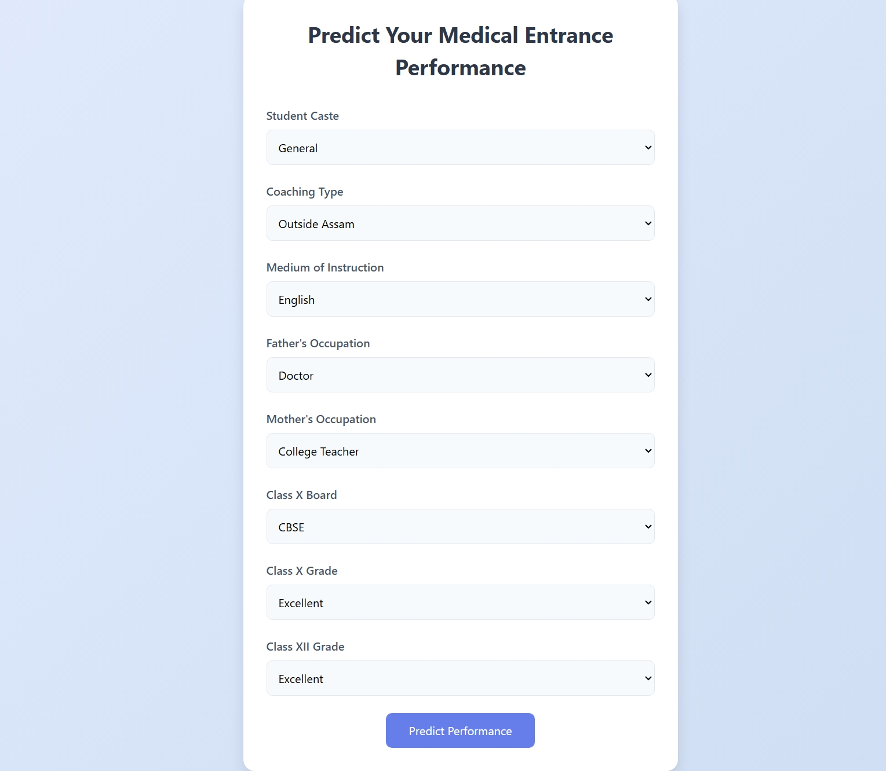
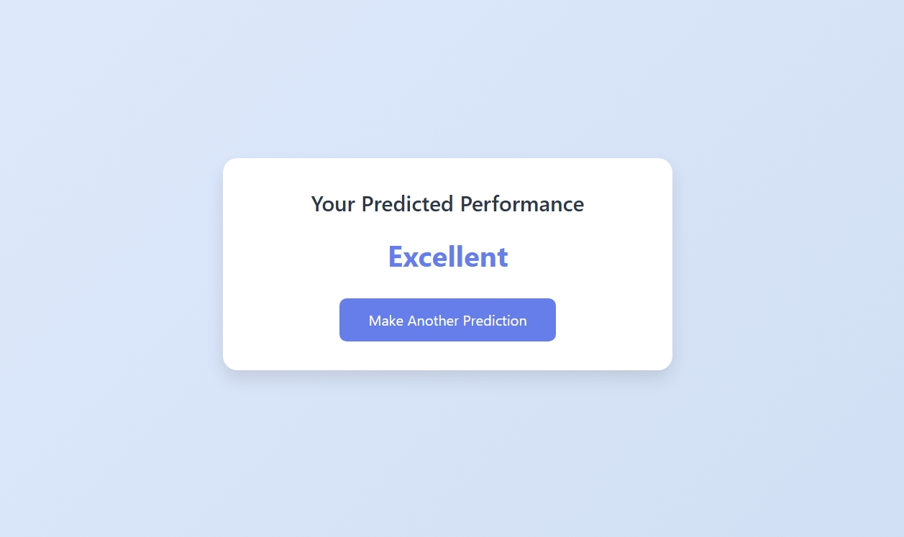
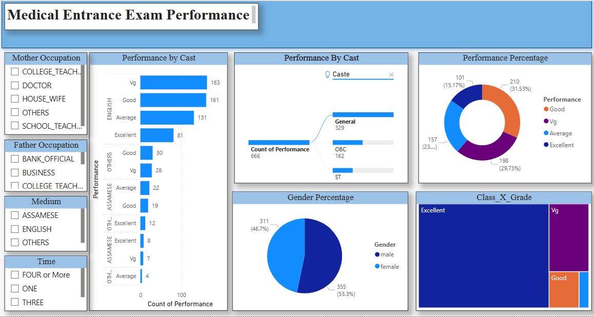

# Medical Entrance Exam Performance Prediction

This project predicts student performance in a medical entrance exam using ordinal classification. The dataset is sourced from the UCI Machine Learning Repository ("Student Performance on an Entrance Examination"). The project includes exploratory data analysis (EDA), data preprocessing, model training with SMOTE to handle class imbalance, and a Flask web application for making predictions.

## Project Overview

- **Objective**: Predict student performance (`Performance`) in a medical entrance exam with ordinal classes: Average, Good, Very Good (Vg), and Excellent.
- **Dataset**: Contains 666 students with features like `Caste`, `coaching`, `medium`, `Father_occupation`, `Mother_occupation`, `Class_ten_education`, `Class_X_Grade`, and `Class_XII_Grade`.
- **Methodology**:
  - Conducted EDA to identify key predictors.
  - Preprocessed data (encoding nominal and ordinal features, dropping irrelevant features like `Gender`, `twelve_education`, `time`).
  - Trained models (Ordinal Logistic Regression, Random Forest, XGBoost) with SMOTE to address class imbalance.
  - Selected the best model based on weighted F1-score.
- **Results**: The best model (with SMOTE) achieved a weighted F1-score of 0.56 on the test set, with an F1-score of 0.50 for the minority class "Excellent". Performance is limited due to the small and imbalanced dataset.

## Project Structure

```
MediPredict/
│
├── data/
│   ├── raw/
│   │   └── student_performance.csv
│   └── processed/
│       └── preprocessed_data.csv
│
├── models/
│   ├── best_model.pkl
│   ├── preprocessor.joblib
│
├── notebooks/
│   ├── medipredict.ipynb
│
├── scripts/
│   ├── model.py
│   ├── app.py
│   ├── utils.py
│   └── Templates/
│       ├── index.html
│       └── result.html
│
├── Report/
│   ├── Medical Entrance Exam Performance.pbit
│   ├── medical_entrance_report.PNG
│
├── config/
│   └── config.yaml
│
├── screenshots/
│   ├── input_form.jpeg
│   ├── result_page.jpeg
│
├── .gitignore
├── README.md
├── requirements.txt
```

## Prerequisites

- **Python Version**: 3.11.12
- **Dependencies**: Listed in `Requirements.txt` with exact versions:
  - pandas==2.2.2
  - numpy==2.0.2
  - scikit-learn==1.6.1
  - xgboost==2.1.4
  - imbalanced-learn==0.13.0
  - joblib==1.4.2
  - matplotlib==3.10.0
  - seaborn==0.13.2
  - mord==0.7
  - flask==3.0.3
  - ucimlrepo==0.0.7

## Setup Instructions

1. **Clone the Repository**:
   ```bash
   git clone https://github.com/aliaagamal/data_science_projects.git
   cd data_science_projects/MediPredict
   ```

2. **Set Up a Virtual Environment** (optional but recommended):
   ```bash
   python -m venv venv
   source venv/bin/activate  # On Windows: venv\Scripts\activate
   ```

3. **Install Dependencies**:
   ```bash
   pip install -r Requirements.txt
   ```

4. **Verify File Placement**:
   - Ensure all binary files (`student_performance.csv`, `preprocessed_data.csv`, `best_model.pkl`, `preprocessor.joblib`, `Medical Entrance Exam Performance.pbit`, `medical_entrance_report.PNG`) are in their respective directories as per the project structure.
   - Ensure `medipredict.ipynb` is in the `notebooks/` directory.

5. **Run the Flask App**:
   ```bash
   cd Scripts
   python app.py
   ```
   - Open `http://127.0.0.1:5000` in your browser to access the prediction interface.

## Usage

- **Explore the Notebook**: Open `notebooks/medipredict.ipynb` to view the EDA, preprocessing, and modeling steps.
- **Make Predictions**:
  - Access the web interface at `http://127.0.0.1:5000`.
  - Fill out the form with student details (e.g., Student Caste, Coaching Type, etc.).
  - Click "Predict Performance" to see the predicted performance (Average, Good, Very Good, or Excellent).
  - Click "Make Another Prediction" to return to the form.

## Interface Screenshots

Below are screenshots of the web interface for making predictions.

- **Input Form**:
  

- **Prediction Result**:
  

## Project Report

The final project report (`Report/Medical Entrance Exam Performance.pbit`) contains detailed findings, including EDA insights, model performance metrics, and visualizations. Below is a screenshot of the report.

- **Report Screenshot**:
  

## Future Improvements

- Collect more data to improve model performance.
- Deploy the Flask app to a cloud platform (e.g., Heroku, AWS) for public access.

## Contact

For any questions or contributions, please contact Aliaa Gamal at alliaagamall@gmail.com.