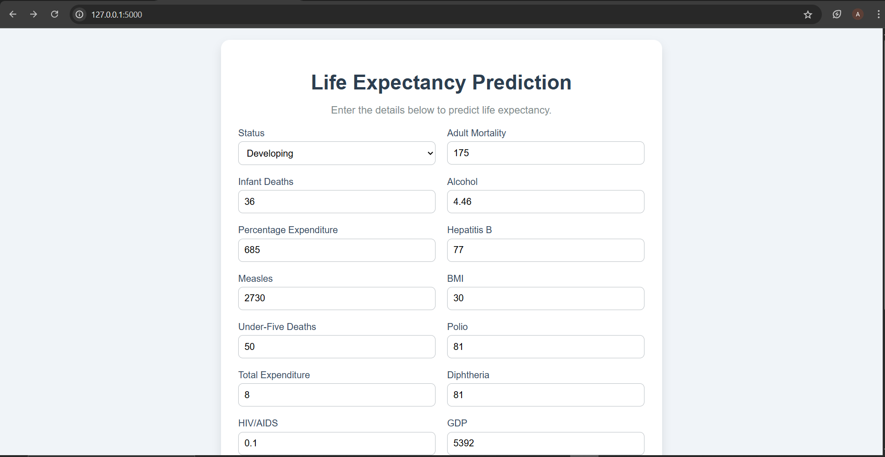
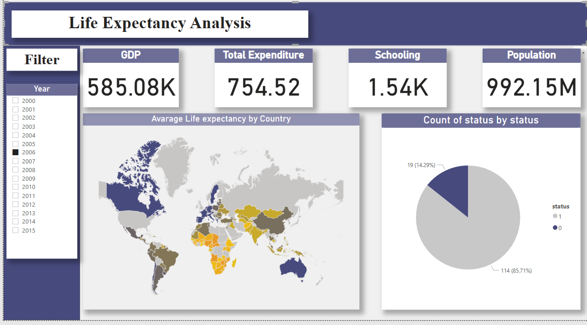

# Life Expectancy Prediction

## Overview
This project predicts life expectancy using machine learning based on health, economic, and social factors. It includes a Flask web application where users can input data and get predictions through a user-friendly interface.

---

## Features
- **Dataset**: Uses *Life Expectancy Data.csv* with 19 features like Adult Mortality, GDP, and Schooling.
- **Machine Learning**: Trained models like XGBoost, LightGBM, and CatBoost, selecting the best performer.
- **Web Application**: A Flask app with an HTML/CSS interface (two-column form, soft colors, tooltips).

---

## Project Structure
```
life-expectancy-prediction/
├── data/
│   ├── raw/
│   │   └── life_expectancy_data.csv
│   ├── processed/
│   │   └── cleaned_life_expectancy_data.csv
├── models/
│   ├── best_model.pkl
│   ├── status_encoder.pkl
├── notebooks/
│   ├── life_expectancy_analysis.ipynb
├── scripts/
│   ├── deploy_model.py
│   ├── app.py
    ├── templates/
│       ├── index.html
│       ├── result.html
├── report/
│   ├── flask_app_screenshot.PNG
    ├── life-expectancy-report.pbit
    ├── life_expectancy_report.PNG
├── README.md
├── requirements.txt

```

---

## Installation
1. **Clone the repository**:
   ```bash
   git clone https://github.com/aliaagamall/life-expectancy-prediction.git
   ```
2. **Create a virtual environment and activate it**:
   ```bash
   python -m venv venv
   venv\Scripts\activate  
   ```
3. **Install dependencies**:
   ```bash
   pip install -r requirements.txt
   ```
4. **Run the Flask app**:
   ```bash
   python scripts/app.py
   ```
5. **Open the web app**:
   Navigate to [http://127.0.0.1:5000](http://127.0.0.1:5000).

---

## Usage
- Open the web app at [http://127.0.0.1:5000](http://127.0.0.1:5000).
- Fill in the form with values for features like Adult Mortality, GDP, Schooling, etc.
- Click **Predict Life Expectancy** to see the predicted result.

---

## Screenshot


---

## Report

A detailed project report is available in `Report/life_expectancy_report.pbit`.

---

## Future Improvements
- Deploy the app online (e.g., on Heroku).
- Add more features to the dataset for better predictions.
- Include visualizations of feature importance in the web app.
